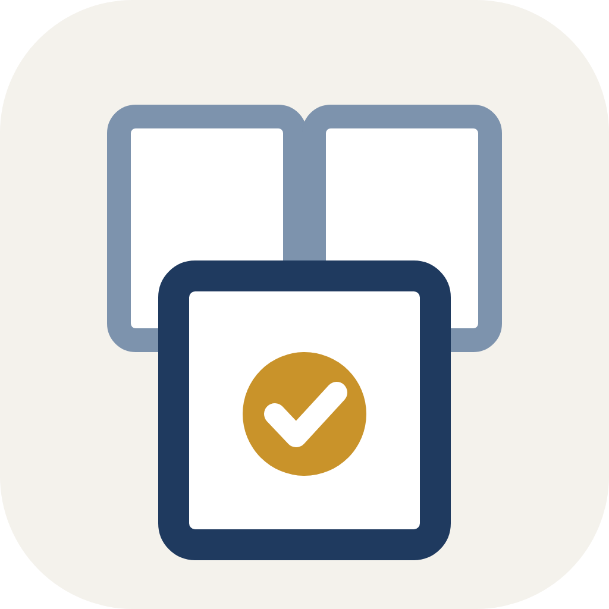

# UDF İmza Birleştirici

Aynı belgenin ayrı ayrı e-imzalanmış nüshalarındaki imzaları **tek dosyada toplar**.

Son tutanağı taraflara sırayla göndermek yerine aynı anda gönderebilirsiniz:
herkes kendi nüshasını imzalar, program imzaları birleştirir. Üç imzalık bir
tutanak için beklenen süre günlerden saatlere iner.

> Program **yeni imza atmaz** ve **belge metnine dokunmaz.** Yalnızca mevcut
> imzaları tek dosyada toplar.

## İndirme

[Sürümler](../../releases) sayfasından işletim sisteminize uygun arşivi indirin.
Kurulum gerekmez.

| | |
|---|---|
| Windows | `UDF-Imza-Birlestirici-Windows.zip` — açıp `.exe` dosyasını çalıştırın |
| macOS (Apple Silicon) | `…-macOS-AppleSilicon.zip` |
| macOS (Intel) | `…-macOS-Intel.zip` |

**İlk açılışta uyarı çıkarsa:** program ücretli bir kod imzalama sertifikasıyla
imzalanmadığı için işletim sistemi uyarı gösterir. Windows'ta "Ek bilgi →
Yine de çalıştır", macOS'ta uygulamaya **sağ tıklayıp "Aç"** deyin.

## Belgeleriniz nereye gidiyor?

**Hiçbir yere.** Program internete bağlanmaz, sunucu kullanmaz, hiçbir veri
göndermez. Tüm işlem kendi bilgisayarınızda yapılır. İnternet bağlantınızı
kesip de kullanabilirsiniz. Arabuluculukta gizlilik esas olduğu için
(6325 sayılı Kanun m.4) program bu şekilde tasarlanmıştır.

## Nasıl kullanılır

1. İmzalanmış nüshaları ekleyin (en az iki `.udf`)
2. **İncele** — program sekiz güvenlik denetimini uygular
3. Denetimler geçerse **Birleştir** düğmesi çıkar; belgeyi kaydedin
4. İsterseniz **Denetim raporu** ve **İmza raporu**'nu panoya kopyalayın

Birleştir düğmesinin altındaki kutu işaretliyse belgenin yanına bir de
denetim kaydı yazılır — hangi nüshaların birleştirildiğinin, hangi imzaların
alındığının ve belge özetinin kalıcı kaydı. Kayıt TC kimlik numaraları
içerdiği için belgeyi paylaşırken yanında göndermemeye dikkat edin.

## Güvenlik denetimleri

Hepsi geçilmeden dosya üretilmez.

| # | Denetim | Ne engeller |
|---|---|---|
| 1 | Belgeler okundu | Bozuk veya imzasız dosya |
| 2 | Belge metni birebir aynı | Farklı metinlerin imzalarının karıştırılması |
| 3 | Tüm imzalar kriptografik olarak geçerli | Bozulmuş veya sahte imza |
| 4 | İmzalar bu belgenin özetine bağlı | İmzanın başka bir metne ait olması |
| 5 | Ortak imza mevcut | İlgisiz belgelerin birleştirilmesi |
| 6 | Mükerrer imzacı yok | Aynı kişinin iki sertifikayla imzalaması |
| 7 | Sertifikalar imza anında geçerliydi | Süresi geçmiş sertifikayla imza |
| 8 | Birleşik belge yeniden doğrulandı | Birleştirme sırasında bozulma |

İkinci denetim metni karşılaştırmakla kalmaz, `content.xml`'in SHA-256 özetini
karşılaştırır: tek bir virgül değişse özet değişir ve birleştirme yapılmaz.

## Neden çalışıyor

UDF imzası **ayrık (detached) CMS**'tir ve imzalar **paraleldir**: her imza
doğrudan `content.xml`'in SHA-256 özetini imzalar, hiçbir imza diğerini
kapsamaz (`counterSignature` kullanılmaz). Bu yüzden ayrı ayrı imzalanmış
nüshaların imza kümeleri birleştirilebilir ve hiçbir imza bozulmaz.

Program, birleştirdiği imza dosyasını UYAP'ın ardışık imzalamada ürettiği
yapının **aynısı** olacak şekilde yazar (imzalar imza zamanına göre sıralanır).
Gerçek belgelerle yapılan karşılaştırmada çıktı, UYAP'ın kendi ürettiği
dosyayla bayt bayt aynı çıkmıştır.

### Standart dışı kodlanmış imzalar

Bazı imzalama araçları, PKCS#1 v1.5 `DigestInfo` yapısına algoritmanın NULL
parametresini yazmaz. OpenSSL gibi katı doğrulayıcılar bu imzaları geçersiz
sayar; UYAP kabul eder ve imza matematiksel olarak doğrudur. Program bu
imzaları **geçerli kabul eder ama işaretler** — dolgunun tamamını ve yapının
tam kaplamasını katı denetleyerek, yalnızca eksik NULL'a izin vererek.

## Bilinen sınırlar

- **Sertifika zinciri doğrulanmaz.** İmzanın matematiksel geçerliliği ve
  imzalayanın kimliği sertifikadan okunur, ancak sertifikayı veren kök makama
  kadar zincir denetlenmez.
- **Zaman damgası yoktur.** UYAP imzalarında zaman damgası bulunmadığı için
  görünen imza saati, imzalayanın kendi bilgisayarının saatidir.
- Yalnızca ayrık imzalı UDF belgeleri desteklenir.

## Kaynaktan çalıştırma

Python 3.9+ yeterlidir; ek paket kurmanız gerekmez.

```bash
python3 uygulama.py
```

**macOS'ta pencere boş görünürse:** macOS'un sistem Python'u 2010 tarihli
Tcl/Tk 8.5 ile gelir ve pencereyi boş çizer. Güncel Tk'li bir Python kullanın:

```bash
brew install python-tk@3.13
/opt/homebrew/bin/python3.13 uygulama.py
```

İndirilen hazır uygulamalarda bu sorun yoktur; güncel Tk paketin içindedir.

Bütünlük sınaması:

```bash
python3 uygulama.py --sinama                    # modüller ve çekirdek işlevler
python3 uygulama.py --sinama a.udf b.udf        # arayüzsüz tam denetim
```

## Sorumluluk

Bu program bağımsız bir yardımcı araçtır; UYAP ile, Adalet Bakanlığı ile veya
herhangi bir kurumla ilgisi yoktur. Ürettiği belgeyi kullanmadan önce UYAP'ta
açıp imzaları kontrol etmek kullanıcının sorumluluğundadır.

## Geliştiren

**Av. Arb. M. İbrahim Asım Bilir**  
av.ibrahimbilir@gmail.com

## Lisans

Kişisel ve mesleki kullanım ile **ücretsiz** dağıtım serbesttir; inceleyebilir
ve değiştirebilirsiniz.

Programı satmak, ücret ya da abonelik karşılığı sunmak veya ticari bir
yazılıma dahil etmek, önceden yazılı izin alınmadıkça yasaktır.

Ayrıntı: [LICENSE](LICENSE)
